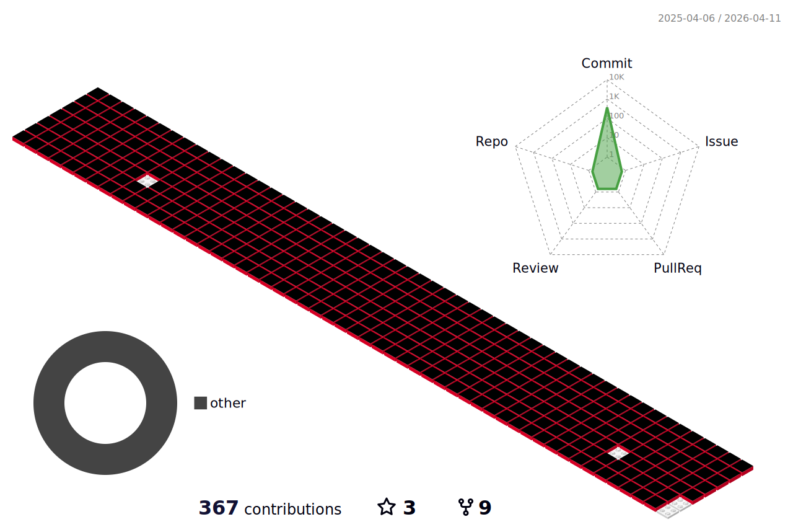

### 백엔드 개발자 윤채영입니다 🙌🏻

##### ✉️ Contact 

- **Github**: [https://github.com/oblsoun](https://github.com/oblsoun)
- **Email**: <a href="mailto:2005941ych@gmail.com">2005941ych@gmail.com</a>
- **Blog**: [https://oblsoun.github.io](https://oblsoun.github.io)

##### 🍃 Contributions

##### 👀 Skills

Can Use

**Database**

 
 

 

**Language**

 
 
 
 
 
 
 
 

 

**Framework & Libraries**

 
 
 
 
 

 

**IDE**

 
 
 

 

**Cloud**

 

##### 📑 Projects

<!--
**oblsoun/oblsoun** is a ✨ _special_ ✨ repository because its `README.md` (this file) appears on your GitHub profile.

Here are some ideas to get you started:

- 🔭 I’m currently working on ...
- 🌱 I’m currently learning ...
- 👯 I’m looking to collaborate on ...
- 🤔 I’m looking for help with ...
- 💬 Ask me about ...
- 📫 How to reach me: ...
- 😄 Pronouns: ...
- ⚡ Fun fact: ...
-->
