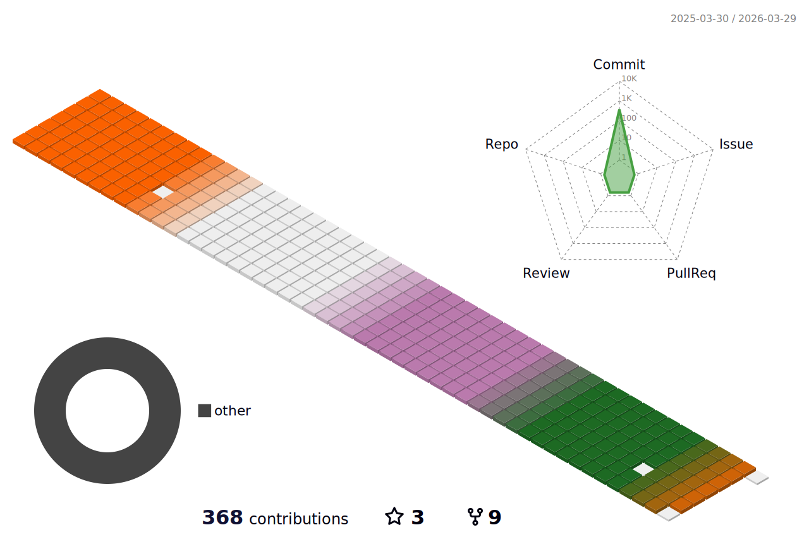

### 백엔드 개발자 윤채영입니다 🙌🏻

### ✨ Link

- **Github**: [https://github.com/oblsoun](https://github.com/oblsoun)

- **Blog**: [https://oblsoun.github.io](https://oblsoun.github.io)

### ✉️ Contact

- **Email**: <a href="mailto:2005941ych@gmail.com">2005941ych@gmail.com</a>

### 🍃 Contributions

### 👀 Skills

Can Use

 
 
 
 
 
 
 
 
 
 
 
 
 
 
 
 
 

 
 

 

### 📑 Projects
**SWIF**

- 스터디 매칭 APP
- 언어: Java
- DB: Firebase
- IDE: Android Studio
- [시연 영상](https://youtu.be/STS_tqPen94)
- [Github](https://github.com/oblsoun/SWIF)

**Varda**

- 스킨케어 화장품 구매 사이트
- 언어: Java
- Framework: Spring boot
- DB: MyBatis, MySQL
- IDE: Eclipse
- [Github](https://github.com/oblsoun/varda)

**Chroma Lens**

- 색약자를 위한 이미지 색채 감지 사이트
- 언어: Python
- Dataset: [Roboflow](https://universe.roboflow.com/msa-ciwxj/yoon-2)
- Model: Yolov8m
- Framework: Django
- IDE: Google COLAB, Pycharm
- [시연 영상](https://youtu.be/LGonUX21H74)
- [Github](https://github.com/oblsoun/chromalens)

**VOV**

- 개인정보 비식별화 지원 사이트
- 언어: Python
- Dataset: [Roboflow](https://universe.roboflow.com/fingerprint-nze3i/vov-k9idv)
- Model: Yolov5m
- Framework: Django
- DB: AWS RDS(mariaDB)
- IDE: Visual Studio Code
- ETC: UML, SonarQube, EC2, S3
- [시연 영상](https://youtu.be/z_S71TbysyU)
- [Github](https://github.com/oblsoun/VOV)

**안전네컷**

- [VOV 프로젝트](https://github.com/oblsoun/VOV) ‘실시간’ 기능을 활용한 사진 촬영 사이트
- 언어: Python
- Dataset: [Roboflow](https://universe.roboflow.com/fingerprint-nze3i/vov-k9idv)
- Model: Yolov5m
- Framework: Django
- IDE: Visual Studio Code
- [시연 영상](https://youtu.be/UCxkyX-NQD4)
- [Github](https://github.com/oblsoun/VOVsnap)

<!--
**oblsoun/oblsoun** is a ✨ _special_ ✨ repository because its `README.md` (this file) appears on your GitHub profile.

Here are some ideas to get you started:

- 🔭 I’m currently working on ...
- 🌱 I’m currently learning ...
- 👯 I’m looking to collaborate on ...
- 🤔 I’m looking for help with ...
- 💬 Ask me about ...
- 📫 How to reach me: ...
- 😄 Pronouns: ...
- ⚡ Fun fact: ...
-->
