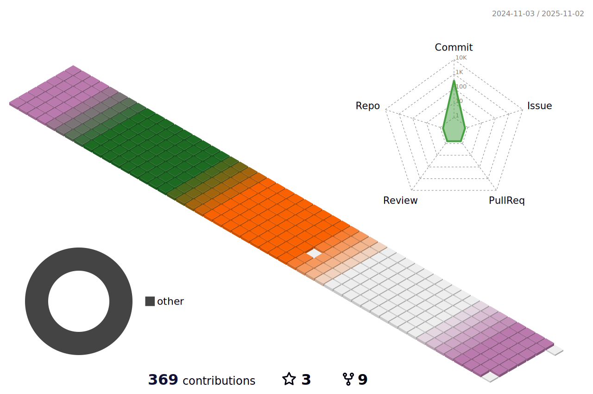

### 백엔드 개발자 윤채영입니다 🙌🏻

### ✉️ Contact 

- **Github**: [https://github.com/oblsoun](https://github.com/oblsoun)
- **Email**: <a href="mailto:2005941ych@gmail.com">2005941ych@gmail.com</a>
- **Blog**: [https://oblsoun.github.io](https://oblsoun.github.io)

### 🍃 Contributions

### 👀 Skills

Can Use

 
 
 
 
 
 
 
 
 
 
 
 
 
 
 
 
 

 
 
 

### 📑 Projects

- [SWIF](https://github.com/oblsoun/SWIF)

스터디 매칭 APP 

- [Varda](https://github.com/oblsoun/varda) 

스킨케어 화장품 구매 사이트 

- [Chroma Lens](https://github.com/oblsoun/chromalens) 

색약자를 위한 이미지 색채 감지 사이트 

- [VOV](https://github.com/oblsoun/VOV) 

개인정보 비식별화 지원 사이트 

- [안전네컷](https://github.com/oblsoun/VOVsnap) 

[VOV 프로젝트](https://github.com/oblsoun/VOV) ‘실시간’ 기능을 활용한 사진 촬영 사이트 

<!--
**oblsoun/oblsoun** is a ✨ _special_ ✨ repository because its `README.md` (this file) appears on your GitHub profile.

Here are some ideas to get you started:

- 🔭 I’m currently working on ...
- 🌱 I’m currently learning ...
- 👯 I’m looking to collaborate on ...
- 🤔 I’m looking for help with ...
- 💬 Ask me about ...
- 📫 How to reach me: ...
- 😄 Pronouns: ...
- ⚡ Fun fact: ...
-->
